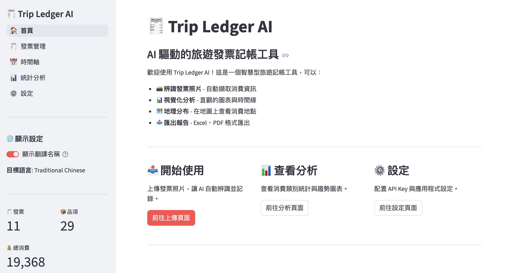
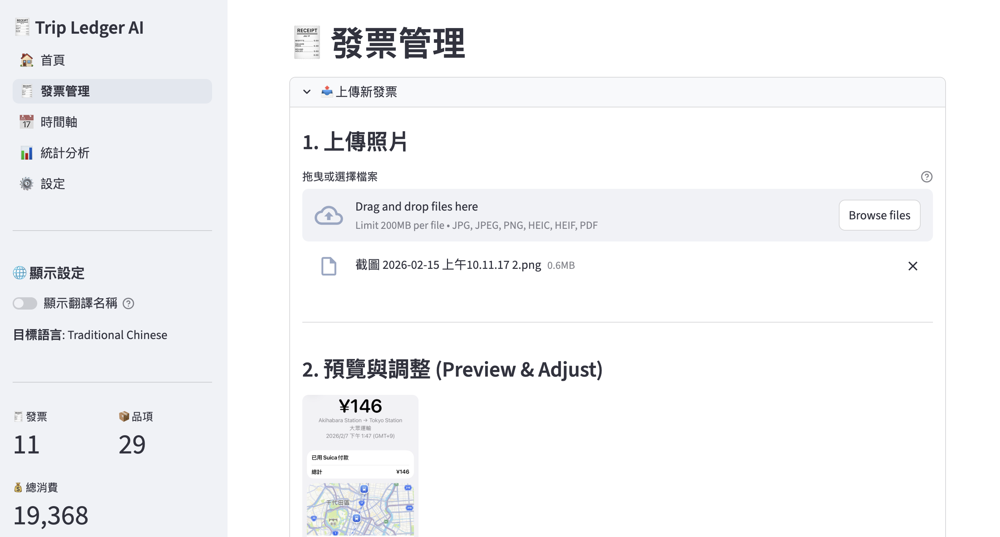
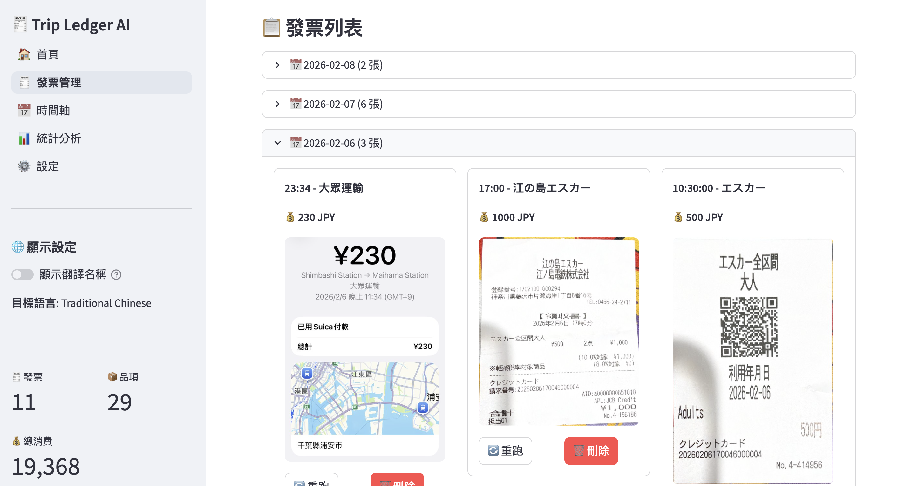
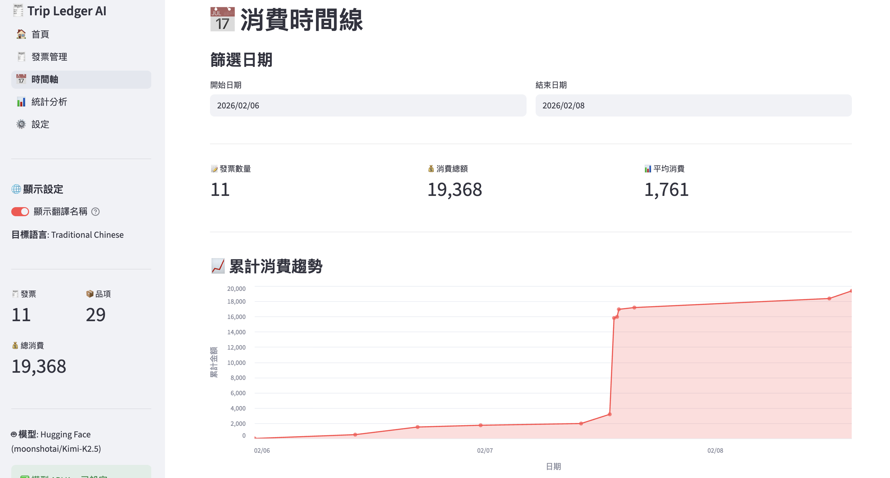
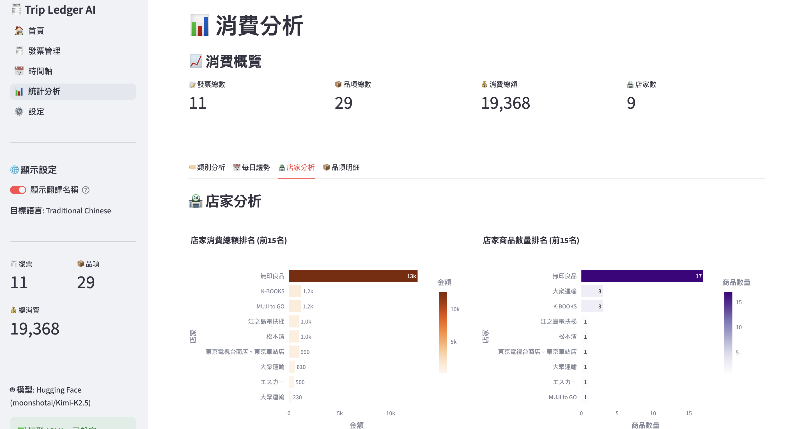
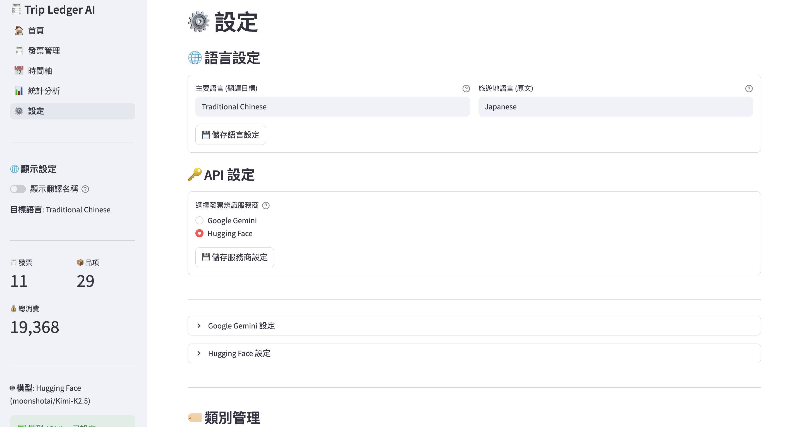

# Trip Ledger AI 🧾

AI 驅動的旅遊發票記帳工具，支援多種 AI 模型（Gemini / Hugging Face）自動辨識發票照片，並提供豐富的視覺化分析。


---

## 📸 應用程式截圖

### 首頁總覽


### 發票上傳與圖片處理


上傳發票照片後，可自動調整圖片尺寸，預覽後再送出 AI 辨識。

### 發票管理清單


辨識完成的發票以卡片形式呈現，可即時編輯品項、類別、金額，也支援重新辨識與刪除。

### 消費時間線


按日期篩選，查看累計消費趨勢圖與每日消費明細。

### 統計分析


涵蓋類別分布、每日趨勢、店家分析與品項明細，提供多維度消費洞察。

### 設定頁面


可切換 AI 模型提供者（Gemini / Hugging Face）、設定 API Key、語言偏好及匯出報告。

---

## ✨ 功能特色

- 📸 **發票照片辨識** - 上傳發票照片，AI 自動擷取店家、品項、金額等資訊
- 🤖 **多模型支援** - 支援 Google Gemini 與 Hugging Face 模型，可自由切換
- 🌍 **多語系支援** - 支援日文、英文、繁體中文發票，自動翻譯品名與店名
- 🏷️ **智慧分類** - 自動將品項分類到 8 大類別與子類別
- 🖼️ **圖片預處理** - 上傳時自動調整尺寸，支援 JPEG、PNG、HEIC、PDF 格式
- 📅 **時間線視覺化** - 按日期查看消費記錄與累計趨勢圖
- 📊 **多維度分析** - 類別分布、每日趨勢、店家排行、品項明細
- 📤 **報告匯出** - 支援 Excel、PDF 格式匯出
- 🔄 **翻譯切換** - 全域切換原文 / 翻譯名稱顯示
- ⚡ **快取機制** - 相同照片不重複處理，節省 API 用量

---

## 🚀 快速開始

### 1. 安裝依賴

```bash
# 使用 uv
uv sync
```

### 2. 設定環境變數

建立 `.env` 檔案：

```bash
cp .env.example .env
```

編輯 `.env`，填入你的 API Key：

```env
# 選擇 AI 提供者 (gemini 或 huggingface)
EXTRACTION_PROVIDER=gemini

# Gemini API（provider 為 gemini 時需要）
GEMINI_API_KEY=your_gemini_api_key_here
GEMINI_MODEL=gemini-2.0-flash

# Hugging Face（provider 為 huggingface 時需要）
HUGGINGFACE_TOKEN=your_huggingface_token_here
HUGGINGFACE_MODEL=Qwen/Qwen2-VL-7B-Instruct
```

或在應用程式的「⚙️ 設定」頁面中直接輸入。

### 3. 啟動應用程式

```bash
make run
```

或：

```bash
uv run streamlit run src/app.py
```

瀏覽器開啟 http://localhost:8501

---

## 📁 專案結構

```
Trip-Ledger-AI/
├── src/
│   ├── app.py                      # Streamlit 主入口
│   ├── config.py                   # 設定管理（API Key、路徑、語言等）
│   ├── extractors/                 # 發票擷取模組
│   │   ├── client.py               #   統一 AI 客戶端（Gemini + HF）
│   │   ├── invoice_parser.py       #   發票解析器
│   │   ├── category_classifier.py  #   品項分類器
│   │   └── image_preprocessor.py   #   圖片預處理
│   ├── etl/                        # 資料處理模組
│   │   ├── storage.py              #   CSV 資料儲存
│   │   ├── models.py               #   Pydantic 資料模型
│   │   ├── exporter.py             #   報告匯出（Excel / PDF）
│   │   └── cache.py                #   處理快取
│   ├── visualization/              # 視覺化模組
│   │   ├── charts.py               #   圖表元件
│   │   ├── timeline.py             #   時間線元件
│   │   └── maps.py                 #   地圖元件
│   ├── ui/                         # UI 元件
│   │   └── sidebar.py              #   共用側邊欄
│   └── pages/                      # Streamlit 頁面
│       ├── 1_receipts.py           #   發票管理（上傳 / 辨識 / 編輯）
│       ├── 2_timeline.py           #   消費時間線
│       ├── 3_analysis.py           #   統計分析
│       └── 5_settings.py           #   設定頁面
├── data/
│   ├── photos/                     # 發票照片
│   ├── cache/                      # 處理快取
│   ├── screenshot/                 # 應用程式截圖
│   ├── categories.json             # 類別定義
│   ├── receipts.csv                # 發票資料
│   └── items.csv                   # 品項資料
├── exports/                        # 匯出報告
├── tests/                          # 測試
├── .agent/                         # Agent Skills & Workflows
├── Makefile                        # 常用指令
├── pyproject.toml                  # 專案設定
└── README.md
```

---

## 🛠️ 常用指令

```bash
make help          # 顯示所有可用指令
make sync          # 同步依賴
make run           # 啟動應用程式
make extract       # 處理發票照片（使用快取）
make extract-force # 強制重新處理所有發票
make export-excel  # 匯出 Excel 報告
make export-pdf    # 匯出 PDF 報告
make clean-cache   # 清除快取
make test          # 執行測試
```

---

## 📊 支援的類別

| 類別 | Emoji | 說明 | 子類別範例 |
|------|-------|------|-----------|
| food | 🍔 | 食物 | meal, snack, groceries |
| beverage | 🥤 | 飲料 | coffee, alcohol, soft_drink |
| transport | 🚃 | 交通 | train, taxi, flight, fuel |
| lodging | 🏨 | 住宿 | hotel, hostel, airbnb |
| shopping | 🛍️ | 購物 | clothing, souvenir, electronics |
| entertainment | 🎢 | 娛樂 | ticket, activity, attraction |
| health | 💊 | 醫療 | pharmacy, medical |
| other | 📦 | 其他 | uncategorized |

---

## 🧠 Agent Skills

本專案包含可重複使用的 Agent Skills：

| Skill | 說明 |
|-------|------|
| **Invoice Extractor** | 從發票照片中擷取結構化資料（多語系） |
| **Category Classifier** | 將商品品項智慧分類到預定義類別 |
| **Geocoder** | 使用 Google Maps API 進行地理定位 |

---

## 💡 使用提示

1. **發票照片** - 確保照片清晰、光線充足
2. **一張一票** - 每張照片只包含一張發票效果最佳
3. **圖片格式** - 支援 JPG、PNG、HEIC、PDF 格式
4. **快取機制** - 相同照片不會重複處理，使用 `--force` 強制重新處理
5. **API 用量** - 每張發票約消耗 1000-2000 tokens
6. **翻譯切換** - 側邊欄可一鍵切換原文 / 翻譯名稱

---

## 📄 授權

MIT License
